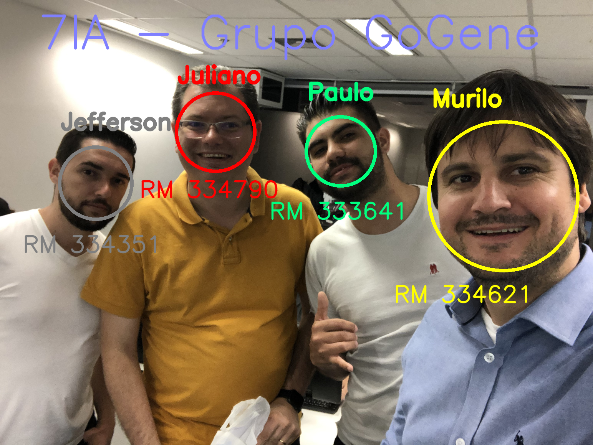

# vc-video-audit
## MBA - FIAP - Inteligência Artificial
## Trabalho Visão Computacional - Auditoria de Video
## Turma 7IA 

## Grupo GoGene

* RM 334351 - Jefferson Dias
* RM 334790 - Juliano Valadares
* RM 334621 - Murilo Cervato
* RM 333641 - Paulo Fernandes

O script resultado está dentro do diretorio **projeto**, com nome **object-people-audit.ipynb**.

Foi criada uma variável ***OPCAO_MODELO***, no início do script, para indicar se os modelos de rede neural serão treinados OU recuperados de treinamento anterior.

Os conteúdos possíveis para a variável são: 
* LER
* SALVAR

A versão disponibilizada neste projeto esta com valor informado igual a *LER*.

Com objetivo de auxiliar a identificação das respostas, criamos o arquivo ***RESPOSTAS.md***, dentro da pasta *projeto*, que contem as implementações e respostas das perguntas do projeto guiado.

